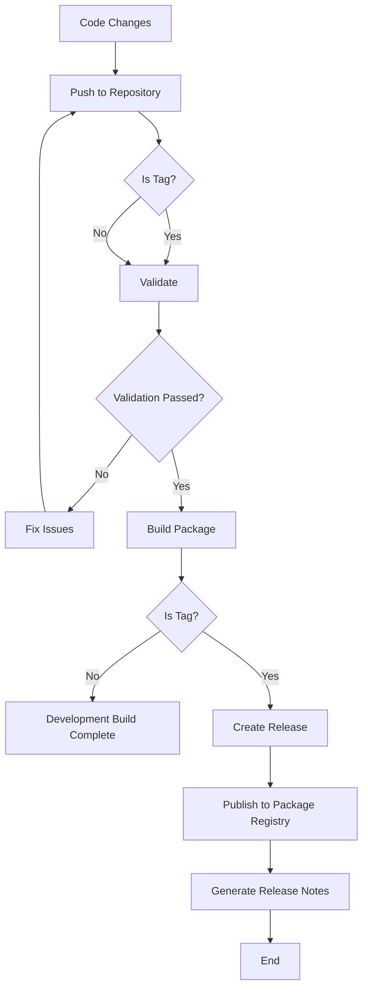

# CI/CD Workflow for Zeversolar Integration

This document describes the CI/CD process for the Zeversolar Home Assistant integration.

## Workflow Overview



## Pipeline Stages

The CI/CD pipeline consists of three main stages:

1. **Validate**: Checks code quality and runs tests (if available)
   - Installs required dependencies
   - Runs unit tests if available
   - Performs linting with pylint

2. **Build**: Creates the packaged integration
   - Uses the `package.sh` script to create a zip file
   - Archives the result as a pipeline artifact

3. **Release**: Creates a GitLab release (only runs on tags)
   - Extracts version from manifest.json
   - Uploads the package to GitLab package registry
   - Generates release notes from CHANGELOG.md
   - Creates a GitLab release with download links

## Release Process

To create a new release:

1. Update the version in `custom_components/zeversolar/manifest.json`
2. Update the CHANGELOG.md with details about the new version
3. Commit and push the changes
4. Create and push a tag with the same version number:
   ```bash
   git tag -a v0.1.2 -m "Release version 0.1.2"
   git push origin v0.1.2
   ```
5. The CI/CD pipeline will automatically build the package and create a release

## Troubleshooting

If the validation stage fails:
- Check the pipeline logs for specific errors
- Fix the identified issues
- Push the changes
- The pipeline will automatically run again

## Maintenance

The CI/CD configuration is maintained in `.gitlab-ci.yml`. If any changes are needed to the CI/CD process, update this file.
